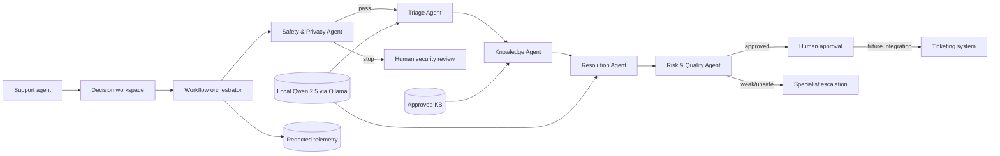

# AegisDesk AI — Six-Layer Architecture

## Executive overview

AegisDesk AI is a controlled multi-agent platform for requests between company departments. Any department may be a requester or a resolver. It reduces clarification, misrouting and repeated search while keeping evidence, safety decisions and human accountability visible. The application defaults to a real Qwen 2.5 model running locally through Ollama; deterministic mock inference is an explicit automated-test mode only.

## 1. Business layer

### Objectives and value

- reduce time from ticket arrival to a qualified first draft;
- reduce repeated clarification loops;
- improve category/priority consistency;
- increase reuse of approved support knowledge;
- preserve accountable human decisions for customer-facing and high-impact actions.

### Users and stakeholders

Requesters and resolvers include IT, Data, Operations, Finance, HR, Security, Ecommerce and other approved specialist departments. A Data team may request operational support, while Operations may report an issue with a data product. Governance stakeholders include the product owner, department service owners, security, privacy/legal, knowledge owners and platform operations.

### Processes affected

Ticket creation → deterministic impact/urgency ranking → initial risk screen → triage → article and verified-case search → first-response drafting → quality review → human approval/escalation → optional human-controlled resolution publishing. The PoC changes no external Jira ticket automatically.

### Pilot KPIs

| Dimension | Metric | Four-week target | Measurement |
|---|---|---:|---|
| Efficiency | Median time to first qualified draft | −40% versus baseline | timestamp from ticket open to approved draft |
| Quality | Wrong-category/priority rework rate | −25% | supervisor correction audit |
| Knowledge | Drafts with accepted approved evidence | ≥85% for covered intents | workflow telemetry |
| Adoption | Agent acceptance without material rewrite | ≥60% | approve/edit decision events |
| Safety | Unsafe autonomous sends | 0 | release-control audit |

Targets are hypotheses, not current measured results. The pilot should collect a two-week baseline and compare like-for-like ticket categories. ROI is calculated from handling minutes saved × ticket volume × loaded labor cost, minus model, platform, and governance costs.

## 2. Agentic / application layer

The application uses role-separated agents with typed inputs/outputs. `WorkflowOrchestrator` owns state transitions; agents cannot call arbitrary tools or send messages. Details are in [docs/AGENT_WORKFLOW.md](docs/AGENT_WORKFLOW.md).

| Agent | Responsibility | Allowed capability | Stop/escalation condition |
|---|---|---|---|
| Safety & Privacy | input screening and minimization | regex policy checks, PII redaction | any injection indicator stops workflow |
| Triage | summary, missing facts, issue type, category, priority, team route | real LLM plus deterministic routing map | provider failure is visible; no silent simulation |
| Knowledge | query refinement and evidence selection | read-only local KB retrieval | no result above threshold escalates |
| Resolution | evidence-constrained draft | real LLM | provider failure is visible; no silent simulation |
| Risk & Quality | taxonomy, provenance, safety and quality validation | deterministic validation rules | unsafe/invalid output blocks; weak evidence escalates |

### Orchestration decisions

1. **Stop:** suspicious prompt instructions route to human security review before any downstream agent runs.
2. **Escalate:** no knowledge above the minimum score routes to a specialist.
3. **Await information:** three or more material gaps request clarification.
4. **Human approval:** every otherwise valid draft waits for explicit approval; high/critical cases carry a stronger reason.
5. **Bound:** the trace is capped at six steps and there is no autonomous send action.

The Streamlit UI separates two audiences. **Page 1 — Employee Help Portal** analyses before submission and exposes safe self-service, similar cases, documentation, missing facts, classification, and recommended team. **Page 2 — Support Workspace** exposes the queue/SLA, assigned/recommended teams, evidence and RAG confidence, editable final response, trace, warnings, and human approve/reject/reassign/escalate/resolve controls. Decisions are logged without raw draft text.

## 3. LLM layer

### Role of the model

The LLM is used only where language interpretation adds value: triage reasoning and response drafting. Safety gating, retrieval, workflow routing, provenance checks, and release controls remain deterministic application logic.

### Prompt strategy

The Triage Agent receives a role-specific system instruction, an allowed category/priority taxonomy, a strict JSON schema, and a prohibition on invented facts. The Resolution Agent receives a separate role, the triage decision, and only accepted article or verified-case evidence. It must acknowledge weak evidence and may not recommend policy bypass. Provider responses are parsed into typed decisions and constrained to approved taxonomy values.

### Model considerations

- **Current default:** real Qwen 2.5 inference on the user's computer through Ollama, configured by `OLLAMA_MODEL`.
- **Alternative:** OpenAI, Azure OpenAI, or another approved compatible endpoint.
- **Automated tests:** explicit deterministic mock mode, never a silent live fallback.
- **Selection criteria:** task accuracy, structured-output reliability, latency, regional availability, privacy terms, token cost, and evaluation performance.
- **Controls:** strict JSON Schema, bounded output, two role-specific calls, provider timeout, PII minimisation and token-usage logging; OpenAI Responses calls also disable provider storage.

Live mode fails visibly when credentials or the provider are unavailable. The UI never labels a deterministic test result as live model output.

## 4. Data layer

### Sources and classification

- runtime tickets, activity history, article metadata, and verified resolutions in the generated local SQLite database `data/aegisdesk.db`;
- reproducible synthetic ticket and resolution fixtures in `data/synthetic_tickets.json`;
- synthetic approved knowledge source files in `data/knowledge_base/`;
- configuration in environment variables;
- privacy-minimized operational telemetry in `logs/app_events.jsonl`.

The first-run seed contains 27 synthetic tickets, including 16 human-labelled verified resolutions, and 20 approved articles spanning workplace IT, ecommerce checkout/fulfillment, data pipelines, cross-department routing, Finance, and HR. Fifteen governed use cases provide repeatable routing and safety evaluations; they do not fine-tune model weights. User-created tickets persist locally. Tickets may contain personal or confidential information and are treated as restricted operational data. Only approved articles and resolutions explicitly verified by a human are eligible for retrieval. KB governance should have named content owners in a pilot.

### Retrieval flow

Approved article paragraphs + human-verified resolved cases → TF-IDF vocabulary/matrix → context-aware query → cosine similarity → minimum score (`0.08`) → unique-source top-3 → evidence passed to Resolution Agent. Answers distinguish article citations from similar verified cases. This is retrieval-augmented generation (RAG), not LLM training or fine-tuning. New case memory enters the corpus only after a human clicks **Resolve ticket + reuse verified solution**. No open-web retrieval and no vector database are used in the PoC.

### Production controls

Before pilot rollout: source-level access controls, ingestion validation, owner and version metadata, scheduled freshness review, deletion/retention policy, data residency decision, encrypted storage/transport, and retrieval evaluation. Embeddings or hybrid search should be adopted only if a labelled evaluation set shows material recall/precision gains.

## 5. Governance, risk and compliance layer

### Key risks and controls

| Risk | Current control | Residual risk / next control |
|---|---|---|
| Prompt injection | suspicious-pattern stop before downstream agents | expand adversarial evaluation and indirect-injection controls |
| Sensitive data disclosure | email/phone redaction across subject, body, requester; no raw prompt logs | enterprise DLP, formal DPIA and retention policy |
| Hallucination | approved KB boundary, threshold, citations, weak-evidence escalation | entailment evaluation and sampled human QA |
| Wrong triage | allowed taxonomy, confidence, editable recommendation | labelled benchmark and drift monitoring |
| Unsafe output | prohibited-phrase and provenance validation | stronger policy classifier/red-team suite |
| Automation bias | visible trace/evidence and mandatory approval | agent training and approval-quality audit |
| Model/provider failure | timeout and deterministic fallback | circuit breaker, retry budget and availability SLO |

The proposed governance rhythm is weekly pilot review and monthly release approval. Prompt/config versions, model approval, evaluation results, incidents, exceptions, and rollback criteria should be recorded. The PoC demonstrates technical controls but does not claim legal certification.

## 6. Operations and monitoring layer

Each completed workflow logs: workflow ID, provider/model, prompt version, total/agent latency, input size, evidence titles and scores, retrieval confidence, quality score, final status, human-review requirement, agent statuses, token usage when available, refusal, fallback, and PII detection. Raw tickets and drafts are excluded.

### Operational scorecard

- **Reliability:** workflow success rate, provider failure/fallback rate, p95 latency, availability.
- **Cost:** prompt/completion/total tokens, estimated cost per completed workflow.
- **Quality:** triage accuracy, evidence precision, groundedness, quality score, material edit rate.
- **Safety:** refusal rate, false-positive/false-negative review, PII incidents, unsupported release count.
- **Business:** first-draft time, rework rate, SLA compliance, acceptance rate, agent/requester satisfaction.

### Improvement loop

Collect redacted metrics → review failed/edited samples → label root causes → update prompt/retrieval/policy in a versioned change → run regression and adversarial evaluation → approve or reject release → monitor canary/pilot → roll back when thresholds fail.

Proposed pilot alerts include p95 latency >10 seconds, provider fallback >5%, quality pass rate <90%, evidence coverage <80% for supported intents, or any unauthorized release/PII incident.

## Architecture principles

- human-centered and accountable;
- bounded autonomy and least privilege;
- evidence before generation;
- privacy by design and data minimization;
- observable decisions, not opaque automation;
- smallest sufficient model and infrastructure;
- honest separation of current capability and roadmap.

## References

- NIST, *AI Risk Management Framework* and *Generative AI Profile*: https://www.nist.gov/itl/ai-risk-management-framework
- OWASP GenAI Security Project, *Top 10 for LLM and GenAI Applications*: https://genai.owasp.org/llm-top-10/
- European Union, *General Data Protection Regulation (EU) 2016/679*: https://eur-lex.europa.eu/eli/reg/2016/679/
- scikit-learn, `TfidfVectorizer`: https://scikit-learn.org/stable/modules/generated/sklearn.feature_extraction.text.TfidfVectorizer.html
- Streamlit documentation: https://docs.streamlit.io/
- Microsoft, Azure OpenAI/Foundry REST reference: https://learn.microsoft.com/en-us/azure/foundry/openai/latest
- Microsoft Learn, Power BI KPI visuals and scheduled refresh guidance: https://learn.microsoft.com/en-us/power-bi/visuals/power-bi-visualization-kpi and https://learn.microsoft.com/en-us/power-bi/connect-data/refresh-scheduled-refresh
- Microsoft Learn, Power BI star-schema guidance: https://learn.microsoft.com/en-us/power-bi/guidance/star-schema
- Stripe Documentation, Checkout fulfillment and Payment Intents: https://docs.stripe.com/checkout/fulfillment and https://docs.stripe.com/payments/payment-intents
