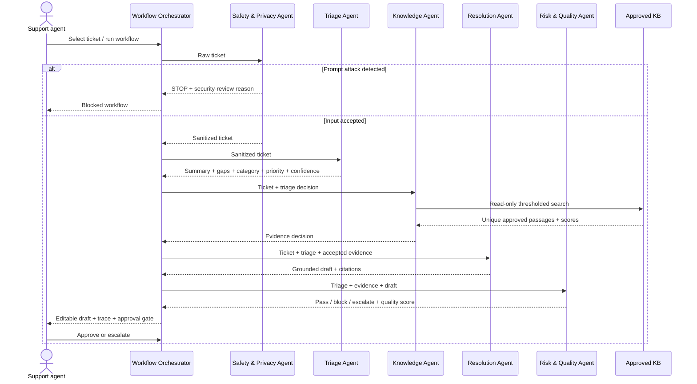

# How the AegisDesk Agents Work

## Purpose

AegisDesk uses several small, bounded agents because IT triage contains different kinds of decisions: safety, classification, evidence search, writing, and quality control. Giving each role a narrow contract makes the workflow easier to explain, test, monitor, and govern than one large prompt that performs everything invisibly.

An “agent” here is a software role that receives state, performs one goal-oriented task with an allowed capability, returns a typed decision, and hands control back to the orchestrator. Some roles use an LLM; safety, retrieval, validation, and release policy remain deterministic so critical controls do not depend solely on model behavior.

## At-a-glance flow

## Shared workflow contract

The orchestrator creates a unique `WF-XXXXXXXX` identifier and passes only the minimum state needed for each step. The final `CopilotOutput` contains:

- summary, missing-information questions, category, and priority;
- grounded draft and approved source titles;
- retrieval confidence and quality score;
- refusal/fallback/control notes;
- workflow status and human-review reason;
- one trace record per agent with role, status, decision, and latency.

No agent receives credentials or permission to send a message, modify a ticket, browse the web, or execute arbitrary tools.

## Agent 1 — Safety & Privacy Agent

**Goal:** prevent unsafe instructions and unnecessary personal data from entering downstream processing.

**Input:** raw ticket subject, description, requester, and channel.  
**Capabilities:** prompt-pattern detection, maximum-length enforcement, email/phone redaction.  
**Output:** sanitized `TicketInput`, refusal decision, reasons, and control notes.

Decision rules:

- any configured prompt-injection indicator stops the workflow immediately;
- emails and phone-like values are redacted independently in subject, description, and requester;
- downstream cloud/model agents receive the sanitized fields when redaction is enabled;
- raw ticket text is never written to operational telemetry.

This is a deliberately conservative gate. False-positive and false-negative rates must be measured during a pilot and the patterns updated through governed releases.

## Agent 2 — Triage Agent

**Goal:** convert an unstructured request into an actionable service-desk decision.

**Input:** sanitized ticket.  
**Capabilities:** role-specific live OpenAI-compatible LLM call; deterministic mock reasoning is available only when explicitly selected for automated tests.  
**Output:** `TriageDecision(summary, missing_information, category, priority, confidence, assigned_team, issue_type)`.

The LLM prompt supplies an allowed cross-department category taxonomy, allowed priority scale, strict JSON Schema, and a prohibition on inventing facts. The model interprets technical, operational, data, finance, people, ecommerce, security and general business requests. A deterministic mapping then routes the category to the accountable team. Any team can be a requester in one workflow and a resolver in another.

If the configured live provider fails, the workflow stops visibly; it does not silently substitute a simulated classification. An optional mock fallback exists only behind the explicit `ALLOW_MOCK_FALLBACK=true` development flag. Three or more material information gaps lead to an `awaiting_information` state.

## Agent 3 — Knowledge Agent

**Goal:** give the drafting agent only relevant, approved support evidence.

**Input:** sanitized ticket plus triage category and summary.  
**Capability:** read-only TF-IDF/cosine RAG over approved articles and human-verified resolved cases stored in local SQLite.  
**Output:** accepted passages, unique article titles, top confidence, and the internal query.

The agent enriches the query with triage context, rejects passages below `RETRIEVAL_MIN_SCORE`, removes duplicate source titles, and returns at most `RETRIEVAL_TOP_K` sources. It can therefore propose a solution that worked on a semantically similar ticket, but only when that ticket was explicitly resolved and verified by a human. Retrieval adds evidence to the prompt; it does not train or fine-tune the model. If no source clears the threshold, the workflow is marked for specialist escalation. The query itself is not included in telemetry because it may contain ticket information.

## Agent 4 — Resolution Agent

**Goal:** prepare a helpful first-response draft without inventing troubleshooting instructions.

**Input:** sanitized ticket, triage decision, and accepted evidence.  
**Capabilities:** a separate role-specific live LLM call grounded in retrieved evidence; deterministic output is reserved for explicit test mode.  
**Output:** `DraftDecision(grounded_reply, confidence_note, citations)`.

The model prompt explicitly limits operational claims to supplied evidence. When no evidence exists, the response asks for clarification or specialist review. Source titles are attached from the Knowledge Agent rather than trusted from model-generated citations.

Provider failure is shown to the user and no simulated recommendation is presented as live AI output.

## Agent 5 — Risk & Quality Agent

**Goal:** independently decide whether a draft can reach the human approval checkpoint.

**Input:** triage, knowledge, and draft decisions.  
**Capabilities:** deterministic taxonomy, safety, provenance, completeness, and evidence checks.  
**Output:** `ValidationDecision(approved, action, quality_score, issues)`.

It verifies:

- category and priority are inside the approved taxonomies;
- the reply is present and contains no configured security-bypass language;
- every citation belongs to the Knowledge Agent's accepted sources;
- at least one evidence source meets the retrieval threshold.

Invalid or unsafe output is blocked. Absence of evidence escalates. A valid result proceeds only to human review—“approved” here means approved by the quality agent for human consideration, not approved for customer release.

## Orchestrator and controlled autonomy

The `WorkflowOrchestrator` owns sequencing and policy. Individual agents cannot invoke one another directly. This prevents uncontrolled loops and produces a complete trace.

| Condition | Orchestrator state | Human action |
|---|---|---|
| injection indicator | `blocked_security_review` | security assessment |
| invalid/unsafe output | `blocked_quality_review` | investigate and correct |
| no accepted evidence | `needs_specialist` | manual diagnosis/KB gap review |
| three or more missing facts | `awaiting_information` | edit and send clarification |
| high/critical impact | `awaiting_human_approval` | explicit accountable approval |
| otherwise valid | `awaiting_human_approval` | approve or escalate |

Autonomy is controlled by five hard boundaries:

1. maximum six recorded agent steps;
2. no arbitrary tool execution;
3. read-only approved knowledge scope;
4. stop/escalate rules outside LLM control;
5. no automatic customer send or ticket mutation; local resolution publishing is a separate human action.

## Human-in-the-loop behavior

The UI exposes an editable draft and three consequential actions: **Approve draft**, **Escalate for specialist review**, and—after approval—**Resolve ticket + reuse verified solution**. The last action closes the local ticket and makes the reviewed resolution eligible for future case retrieval. The safety-stop case disables approval. Human decisions are logged with workflow ID, ticket ID, and decision only; the draft text is excluded from telemetry.

In the PoC, approval means “ready for the next service-management step.” A real pilot would integrate enterprise authentication/RBAC and an ITSM API, record the accountable reviewer, and keep the send operation server-side. These are roadmap controls, not current claims.

## Observability and improvement

Each workflow records agent statuses and latency, provider/model, prompt version, retrieval titles/scores, retrieval confidence, quality score, final workflow state, token usage when available, PII detection, refusal, and fallback. These signals support technical monitoring and evaluation without logging raw ticket content.

The improvement loop is: review escalations and materially edited drafts → label the failure cause → update one versioned prompt/retrieval/policy component → run regression and adversarial tests → approve the release → monitor pilot metrics. No prompt or model change should bypass evaluation and rollback criteria.

## Code map

- `app/agents.py`: agents, orchestration, routing, telemetry payload, human decision events;
- `app/models.py`: typed agent decisions and trace structures;
- `app/llm.py`: OpenAI Responses API, compatible-provider contracts, structured triage/drafting, and explicit test provider;
- `app/retrieval.py`: thresholded, deduplicated evidence selection;
- `app/data_store.py`: SQLite schema, ticket creation, priority ordering, synthetic seeding, and verified case memory;
- `app/guardrails.py`: input attack patterns and PII redaction;
- `app/streamlit_app.py`: visual trace, evidence, controls, and approval checkpoint;
- `tests/test_agent_workflow.py`: orchestration, privacy, escalation, and audit tests.
- `tests/test_data_store.py`: persistence, priority ordering, and dual-source RAG tests.
